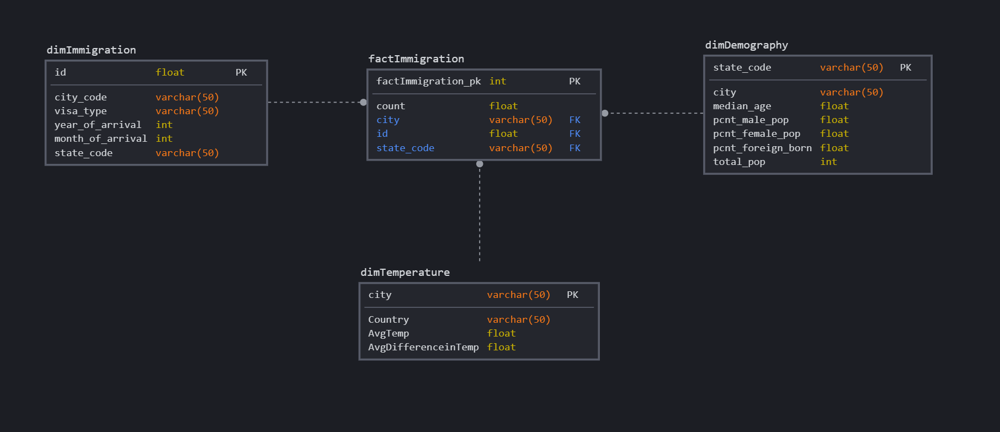

## Project Summary
This project aims to be able to answers questions around US immigration. We extract data from three different data sources, the I94 immigration dataset of 2016, city temperature data from Kaggle and US city demographic data from OpenSoft. We have designed 3 dimension tables: dimTemperature, dimImmigration , dimDemographics and one fact table: factImmigration. We use Spark for ETL jobs and store the results in parquet for downstream analysis

## Data Source 

**I94 Immigration Data**: comes from the U.S. National Tourism and Trade Office and contains various statistics on international visitor arrival in USA and comes from the US National Tourism and Trade Office. The dataset contains data from 2016. 
**World Temperature Data**: comes from Kaggle and contains average weather temperatures by city.  
**U.S.City Demographic Data**: comes from OpenSoft and contains information about the demographics of all US cities such as average age, male and female population. 

## Data Model

### **DIMENSION TABLES**

1.**dimImmigration** : It contains immigration events

* id               - Unique Identifier
* state_code       - State Code
* city_code        - City Code 
* visa_type        - Type of visa issues
* year_of_arrival  - Year of Arrival to US
* month_of_arrival - Month of Arrival to US

2.**dimTemperature** :  It contains average temparature city in US

* Country             - Country Name
* City                - City Name
* AvgTemp             - Average Temperature in City
* AvgDifferenceinTemp - Average Variation In Temperature

3.**dimDemography** : It has information on Demographic Statistics

* state_code         - State Code
* city               - City Name
* median_age         - Median age of people in city
* pcnt_male_pop      - Percentage of Male Population
* pcnt_female_pop    - Percentage of Female Population
* pcnt_foreign_born  - Percentage of People who are born outside US 
* total_pop          - Total Polulation

### **FACT TABLES**

4.**factImmigration** : The Fact table gives the count of entry into US soil.

* factImmigration_pk  - Unique Identifier
* id                  - Unique Identifier of dimImmigration
* city                - City Name
* state_code          - State Code

## Discussion
Possible Solutions if ,
 * **The data was increased by 100x.** 
We can consider spinning up larger instances of EC2s hosting Spark and/or additional Spark work nodes. With added capacity arising from either vertical scaling or horizontal scaling, we should be able to accelerate processing time.
 * **The data populates a dashboard that must be updated on a daily basis by 7am every day.**
We can consider using Airflow/Oozie to schedule and automate the data pipeline jobs.
 * **The database needed to be accessed by 100+ people.**
We can use AWS Redshift With Concurrency Scaling feature, which can support virtually unlimited concurrent users and concurrent queries, with consistently fast query performance. When concurrency scaling is enabled, Amazon Redshift automatically adds additional cluster capacity when you need it to process an increase in concurrent read queries. Write operations continue as normal on your main cluster. Users always see the most current data, whether the queries run on the main cluster or on a concurrency scaling cluster.